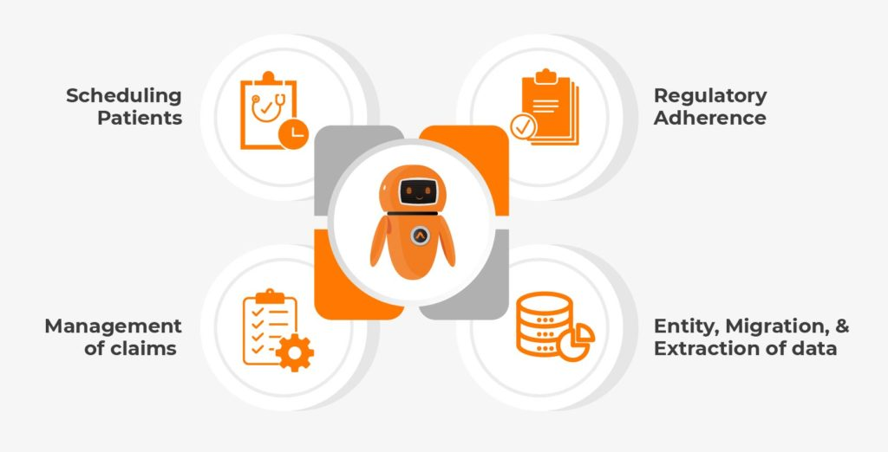

RPA has genuinely turned to be a strong force, disposing of all failures across the medical care measures:

So What Does RPA Mean for the Healthcare Industry?

Different requesting errands, for example, guarantee taking care of, exist in medical services frameworks and require a critical asset distribution. This outcomes in high functional expenses and deferred measures.

Utilizing the capability of mechanization and RPA in medical services experts can address these worries and work on understanding fulfillment by making medical care frameworks and cycles more effective and quicker.

For what reason is RPA significant in Healthcare?

Robotic Process Automation is a directing light for the medical services monsters as this industry is perhaps the most customary organizations with greatest hesitance to modernize. Dispensing with shortcomings would bring about better medical services conveyance, which is helpful to both the business and everyone.

Shortcomings are unavoidable, yet few defy the issues like rigid laws in regards to patient information and an absence of assets to adapt to them. Innovation, particularly robotization, can enable the medical care monsters to reinforce their information base administration frameworks, permitting the laborers to zero in on the patient's well being instead of squandering energy on documentation and other automated errands.

The assets for It and medical care administrations are totally gotten from the profit of medical care suppliers. RPA empowers medical services suppliers to keep away from expensive, long-running advanced change execution ventures and gain speedy outcomes, permitting them to commit more assets to patient consideration.

What are RPA Use Cases in Healthcare?

**Scheduling Patients**

Patients can make arrangements without the mediation of medical clinic laborers on account of the utilization of RPA innovation. As well as taking out the necessity for asset designation for planning, this application can further develop client relations by permitting patients to plan arrangements all the more rapidly.

**Management of Claims**

Charging sets aside time after a medical care administration is performed as a result of the manual, commonplace, and dull obligations engaged with the case the executives cycle. Information, preparing, and assessment of archives and information are all essential for guarantee the board. RPA-drove guarantee the executives can wipe out human mistakes during guarantee handling as well as robotizing tedious activities. As per research, Medicare/Medicaid protection misrepresentation represents the majority of bogus cases among any remaining kinds of protection extortion in the United States. Also, computerization wipes out these critical dangers!

**Regulatory Adherence**

RPA helps medical services suppliers track and report each interaction step in organized log records to meet outside review necessities. Also, RPA further develops information secrecy since bots handle these cycles.

**Entity, Migration, and Extraction of information**

The medical services business is intensely dependent on paper records and is in urgent need of computerized change. For instance, patients' data is being digitized by medical services suppliers to be put away electronically and got to online by different specialists and patients. RPA bots can robotize the method involved with separating information from inheritance frameworks and entering it into advanced ones. Then, at that point, when information should be moved for another reason, like clinical examination, a particular RPA bot can deal with it.

What are the Benefits of RPA in Healthcare?

Coming up next are the top advantages of RPA in the medical services industry:

**Cost reserve funds:** RPA programming costs a negligible part of what medical care firms pay laborers to perform manual exercises. As indicated by the CAQH report, robotizing regulatory obligations in the income cycle might save the medical services business $13.3 billion.

**Convenient updates:** Patients are more averse to miss their arrangements because of the robotization of patient planning and arrangement updates sent by the RPA bot, permitting specialists to see more patients, expanding usefulness and proficiency.

**Relieving human mistake chances:** Human blunder is disposed of in light of the fact that bots adhere to pre-modified standards in rule-based activities. Subsequently, the guidelines based system will be sans blunder if the software engineer doesn't commit any errors when composing code.

**Improvement of Patient's Experience:**RPA bots mechanize front-office help and simplify it for the patient help group to deal with patient requests. The utilization of mechanical interaction robotization (RPA) framework toward the front and administrative centers permits medical care suppliers to give better client care.

**Upgraded worker fulfillment:** Employee fulfillment might experience the ill effects of relegating tedious positions to the group, which can prompt higher representative turnover. Therefore, there is really enrolling and onboarding, and representatives are undeniably less useful. With RPA, the responsibility is less, and worker fulfillment duplicates.

Peruse Also: 10 Tips for Successful Robotic Process Automation Implementation in 2021

What to Consider for a Successful RPA Implementation?

RPA executions, similar to some other mechanical undertaking, can fizzle for an assortment of reasons, including an absence of preparing, destructive use cases, overlooking fundamental partners, and that's just the beginning.

CIO suggests that organizations take on various accepted procedures for a fruitful RPA sending, including directing broad exploration, instructing work force, building up a solid use case, and surveying security.

Additionally, remember that RPA is an exceptionally youthful innovation with quickly extending potential to change heritage tasks. In this manner, associations should initially sort out what issue they need to handle with RPA and which apparatuses would assist them with arriving.

Consider reaching us when assembling a RPA system, choosing an arrangement, and executing customized business arrangements.